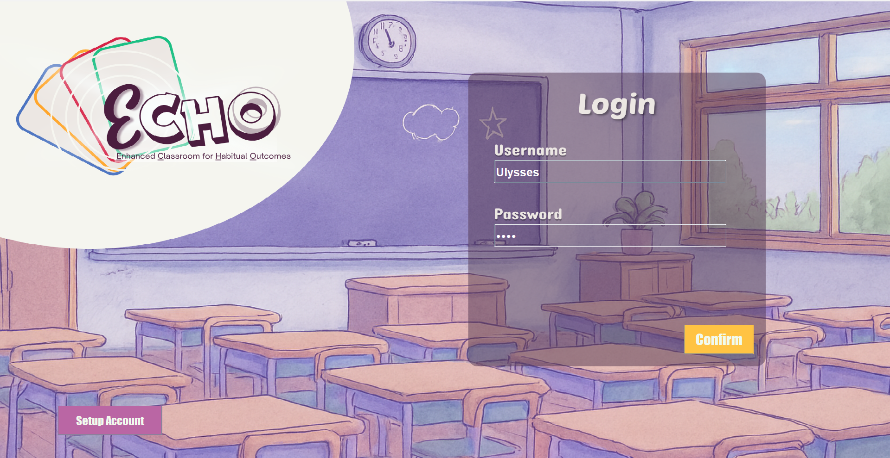
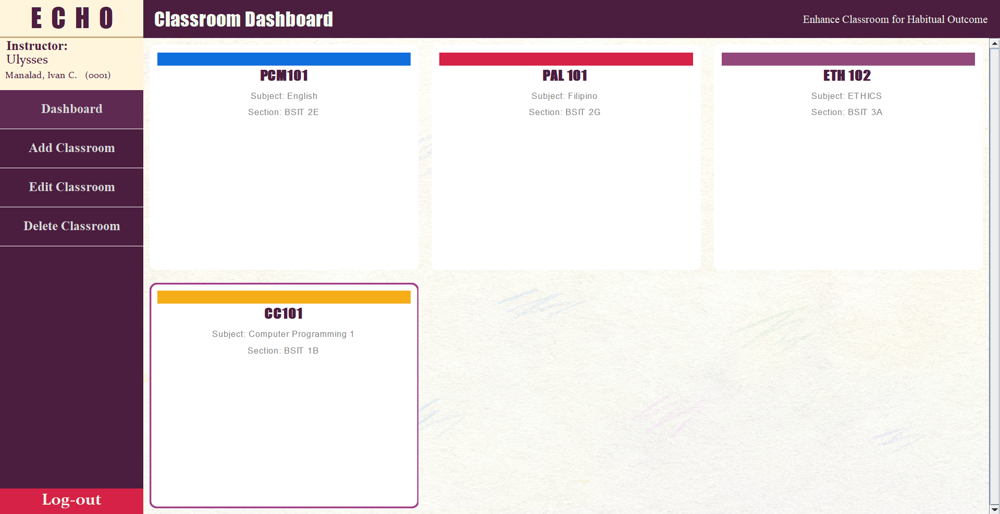
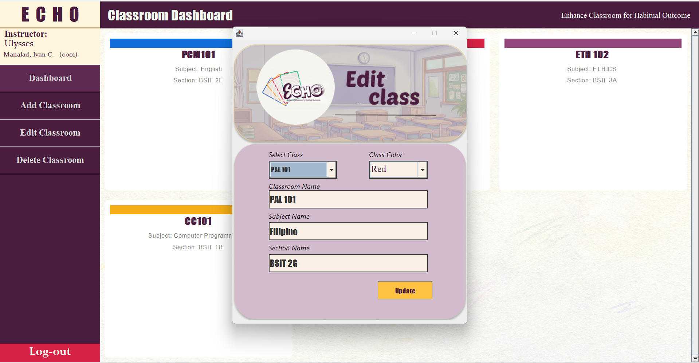
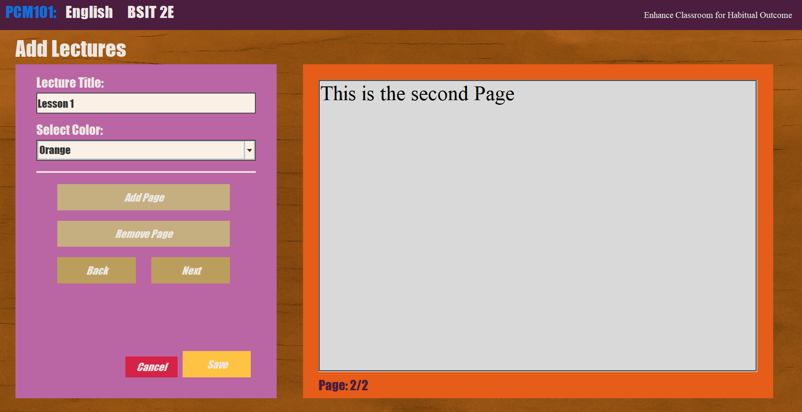
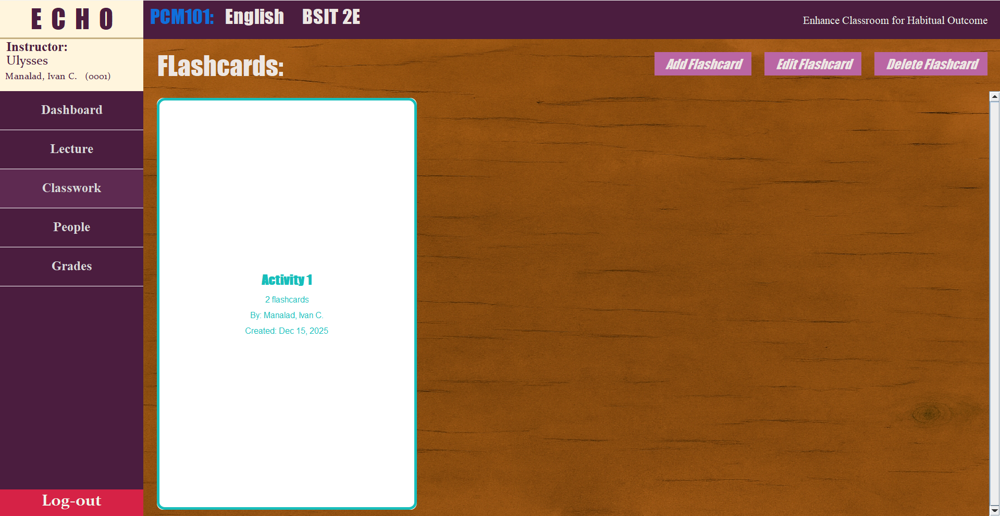
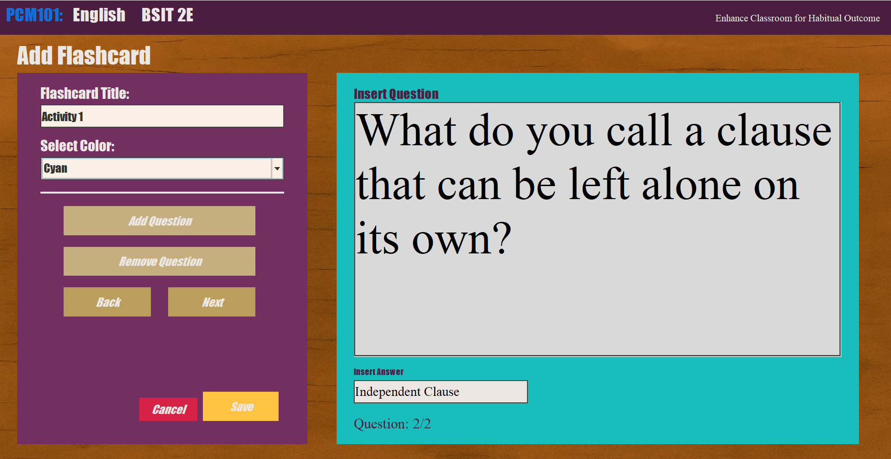
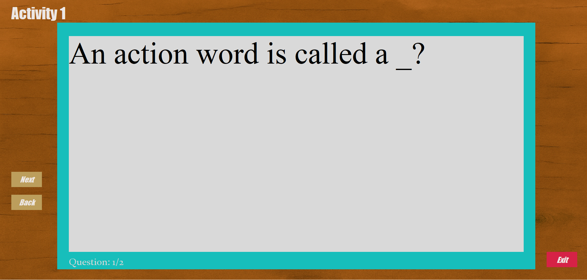
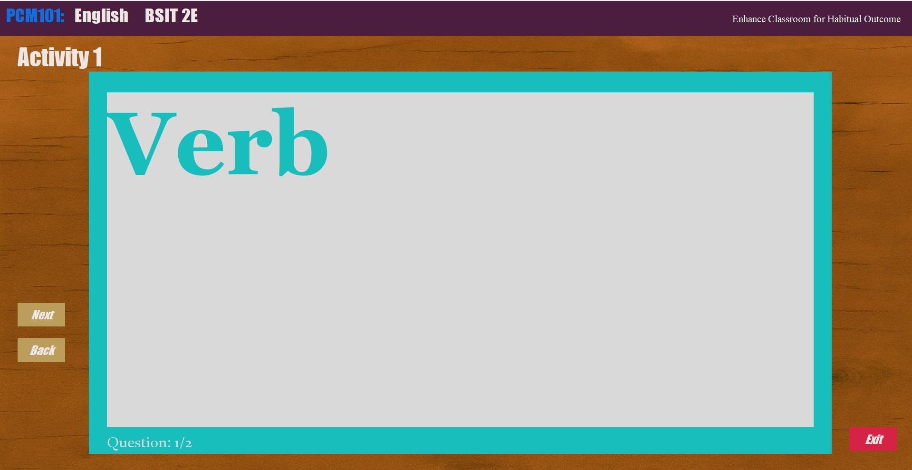

# ECHO-Enhanced-Classroom-for-Habitual-Outcome-
To provide a centralized academic tool for excellent instruction, this program aims to digitalize the means of learning by integrating classroom management system with lecture/activity creation. 
This application utilizes Java Programming Language.

## 📸 Program Screenshots

